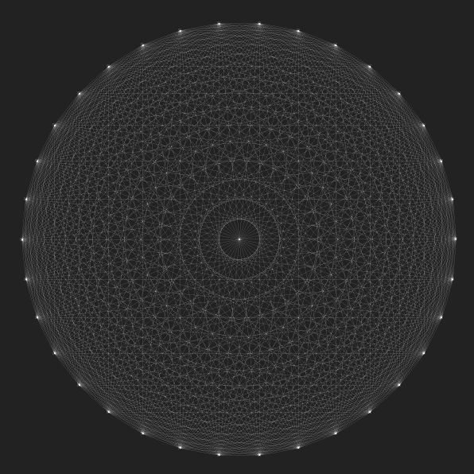

# Complete Graph



## Usage

```
$ luarocks install lua-sdl2
$ luarocks install argparse
$ lua complete-graph -h
$ lua complete-graph
```

### Keyboard Shortcuts

- `Up/k` increment the number of nodes
- `Down/j` decrement the number of nodes
- `Right/l` increment alpha
- `Left/h` decrement alpha
